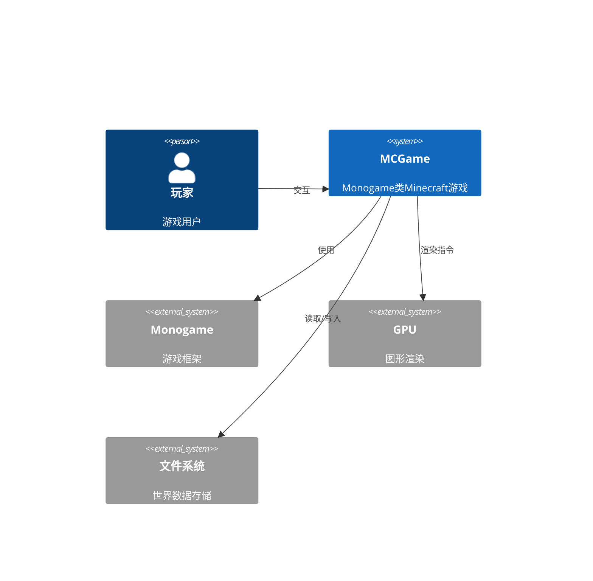

# 系统架构设计文档

## 执行摘要

本文档描述了基于Monogame框架的类Minecraft游戏（MCGame）的完整系统架构设计。该架构专注于高性能的3D体素化世界渲染，通过区块系统、DrawCall优化和多线程处理等技术手段，实现流畅的60 FPS游戏体验。

## 架构概述

### 系统上下文图


### 容器图
```mermaid
C4Container
    Container(game, "游戏主程序", "C#", "主游戏循环和系统管理")
    Container(world, "世界系统", "C#", "区块管理和世界生成")
    Container(render, "渲染系统", "C#/HLSL", "3D渲染和优化")
    Container(input, "输入系统", "C#", "玩家输入处理")
    Container(ui, "UI系统", "C#", "用户界面渲染")
    Container(audio, "音频系统", "C#", "音效和音乐")
    
    Rel(game, world, "世界数据")
    Rel(game, render, "渲染指令")
    Rel(game, input, "输入事件")
    Rel(game, ui, "UI渲染")
    Rel(game, audio, "音频播放")
    Rel(render, gpu, "GPU指令")
    Rel(world, storage, "数据持久化")
```

## 核心架构设计

### 1. 区块系统架构

#### 区块数据结构
```csharp
// 区块坐标结构
public struct ChunkPosition {
    public int X, Y, Z;
    public override int GetHashCode() => HashCode.Combine(X, Y, Z);
}

// 方块数据结构（16位紧凑存储）
public struct BlockData {
    public ushort Value; // 12位方块类型 + 4位元数据
    public BlockType Type => (BlockType)(Value & 0x0FFF);
    public byte Metadata => (byte)(Value >> 12);
}
```

#### 区块类设计
```csharp
public class Chunk {
    // 常量定义
    public const int SIZE = 16;
    public const int HEIGHT = 256;
    public const int VOLUME = SIZE * SIZE * HEIGHT;
    
    // 区块属性
    public ChunkPosition Position { get; }
    public BlockData[,,] Blocks { get; private set; }
    public ChunkMesh Mesh { get; private set; }
    public bool IsDirty { get; set; }
    public bool IsLoaded { get; set; }
    
    // 性能优化：使用16位数据而非32位减少内存占用
    private readonly BlockData[,,] _blocks;
    
    // 区块状态管理
    public ChunkState State { get; set; }
    
    public Chunk(ChunkPosition position) {
        Position = position;
        _blocks = new BlockData[SIZE, HEIGHT, SIZE];
        State = ChunkState.Unloaded;
    }
}

public enum ChunkState {
    Unloaded,
    Loading,
    Generating,
    Meshing,
    Ready,
    Unloading
}
```

#### 区块管理器
```csharp
public class ChunkManager {
    // 区块缓存和对象池
    private readonly Dictionary<ChunkPosition, Chunk> _loadedChunks;
    private readonly Queue<Chunk> _chunkPool;
    private readonly ConcurrentQueue<ChunkPosition> _generationQueue;
    
    // 多线程处理
    private readonly Task[] _generationWorkers;
    private readonly CancellationTokenSource _cancellationToken;
    
    // 性能优化：使用空间分区快速查找
    private readonly SpatialHashGrid<Chunk> _spatialIndex;
    
    // 区块加载配置
    private readonly int _loadRadius = 10;
    private readonly int _unloadRadius = 15;
    
    public ChunkManager() {
        _loadedChunks = new Dictionary<ChunkPosition, Chunk>();
        _chunkPool = new Queue<Chunk>();
        _generationQueue = new ConcurrentQueue<ChunkPosition>();
        _spatialIndex = new SpatialHashGrid<Chunk>(16);
        
        // 启动多线程生成器
        _generationWorkers = new Task[Environment.ProcessorCount];
        _cancellationToken = new CancellationTokenSource();
        
        for (int i = 0; i < _generationWorkers.Length; i++) {
            _generationWorkers[i] = Task.Run(GenerationWorker);
        }
    }
}
```

### 2. 渲染系统架构

#### 渲染管道设计
```csharp
public class RenderPipeline {
    // 渲染阶段
    private readonly List<IRenderPass> _renderPasses;
    
    // 性能优化：批量渲染
    private readonly Dictionary<Material, List<RenderBatch>> _renderBatches;
    
    // GPU资源管理
    private readonly VertexBufferManager _vertexBufferManager;
    private readonly IndexBufferManager _indexBufferManager;
    
    public RenderPipeline(GraphicsDevice graphicsDevice) {
        _renderPasses = new List<IRenderPass>();
        _renderBatches = new Dictionary<Material, List<RenderBatch>>();
        
        // 初始化渲染阶段
        InitializeRenderPasses();
    }
    
    private void InitializeRenderPasses() {
        // 深度预处理阶段
        _renderPasses.Add(new DepthPrePass());
        
        // 阴影渲染阶段
        _renderPasses.Add(new ShadowPass());
        
        // 不透明物体渲染阶段
        _renderPasses.Add(new OpaquePass());
        
        // 透明物体渲染阶段
        _renderPasses.Add(new TransparentPass());
        
        // UI渲染阶段
        _renderPasses.Add(new UIPass());
    }
}
```

#### 区块网格合并系统
```csharp
public class ChunkMesher {
    // 性能优化：顶点数据预分配
    private readonly List<VertexPositionNormalTexture> _vertices;
    private readonly List<ushort> _indices;
    
    // 面剔除优化
    private readonly bool[,,] _visibilityCache;
    
    public ChunkMesh GenerateMesh(Chunk chunk, Chunk[,,] neighbors) {
        _vertices.Clear();
        _indices.Clear();
        
        // 遍历所有方块，生成可见面
        for (int x = 0; x < Chunk.SIZE; x++) {
            for (int y = 0; y < Chunk.HEIGHT; y++) {
                for (int z = 0; z < Chunk.SIZE; z++) {
                    BlockData block = chunk.GetBlock(x, y, z);
                    if (block.Type != BlockType.Air) {
                        AddVisibleFaces(chunk, neighbors, x, y, z, block);
                    }
                }
            }
        }
        
        return CreateMesh();
    }
    
    private void AddVisibleFaces(Chunk chunk, Chunk[,,] neighbors, int x, int y, int z, BlockData block) {
        // 检查六个方向的可见性
        if (IsFaceVisible(chunk, neighbors, x, y, z, Direction.Up)) {
            AddFace(x, y, z, Direction.Up, block);
        }
        // ... 其他方向
        
        // 性能优化：避免重复计算
        CacheVisibilityData(x, y, z);
    }
}
```

#### 视锥剔除实现
```csharp
public class FrustumCulling {
    private BoundingFrustum _frustum;
    private readonly Dictionary<ChunkPosition, BoundingBox> _chunkBounds;
    
    public void UpdateFrustum(Matrix view, Matrix projection) {
        _frustum = new BoundingFrustum(view * projection);
    }
    
    public bool IsChunkVisible(ChunkPosition position) {
        if (!_chunkBounds.TryGetValue(position, out var bounds)) {
            bounds = CalculateChunkBounds(position);
            _chunkBounds[position] = bounds;
        }
        
        return _frustum.Intersects(bounds);
    }
    
    public List<Chunk> GetVisibleChunks(Dictionary<ChunkPosition, Chunk> chunks) {
        var visibleChunks = new List<Chunk>();
        
        foreach (var chunk in chunks.Values) {
            if (IsChunkVisible(chunk.Position)) {
                visibleChunks.Add(chunk);
            }
        }
        
        return visibleChunks;
    }
}
```

### 3. 性能优化策略

#### DrawCall优化
```csharp
public class RenderOptimizer {
    // 策略1：实例化渲染
    private readonly Dictionary<BlockType, InstancedBlockData> _instancedBlocks;
    
    // 策略2：纹理图集
    private readonly TextureAtlas _textureAtlas;
    
    // 策略3：距离剔除
    private readonly Dictionary<ChunkPosition, float> _chunkDistances;
    
    // 策略4：LOD系统
    private readonly LODSystem _lodSystem;
    
    public void OptimizeRendering(List<Chunk> visibleChunks) {
        // 按距离排序区块
        visibleChunks.Sort((a, b) => 
            GetChunkDistance(a.Position).CompareTo(GetChunkDistance(b.Position)));
        
        // 应用LOD
        foreach (var chunk in visibleChunks) {
            var lodLevel = _lodSystem.GetLODLevel(GetChunkDistance(chunk.Position));
            RenderChunkWithLOD(chunk, lodLevel);
        }
    }
    
    private void RenderChunkWithLOD(Chunk chunk, int lodLevel) {
        // 根据LOD级别选择不同的渲染策略
        switch (lodLevel) {
            case 0: // 高细节
                RenderChunkDetailed(chunk);
                break;
            case 1: // 中等细节
                RenderChunkMedium(chunk);
                break;
            case 2: // 低细节
                RenderChunkLow(chunk);
                break;
        }
    }
}
```

#### 内存管理优化
```csharp
public class MemoryManager {
    // 对象池
    private readonly ObjectPool<Chunk> _chunkPool;
    private readonly ObjectPool<ChunkMesh> _meshPool;
    
    // 内存监控
    private readonly MemoryMetrics _metrics;
    
    // 资源缓存
    private readonly Dictionary<string, Texture2D> _textureCache;
    private readonly Dictionary<BlockType, Effect> _effectCache;
    
    public void OptimizeMemoryUsage() {
        // 卸载远距离区块
        UnloadDistantChunks();
        
        // 清理未使用的资源
        CleanupUnusedResources();
        
        // 压缩内存
        CompactMemory();
    }
    
    private void UnloadDistantChunks() {
        var chunksToUnload = _loadedChunks
            .Where(kv => GetChunkDistance(kv.Key) > _unloadRadius)
            .Select(kv => kv.Value)
            .ToList();
            
        foreach (var chunk in chunksToUnload) {
            UnloadChunk(chunk);
        }
    }
}
```

### 4. 多线程架构

#### 任务系统
```csharp
public class TaskScheduler {
    private readonly ConcurrentQueue<GameTask> _taskQueue;
    private readonly Task[] _workerThreads;
    private readonly CancellationTokenSource _cancellationToken;
    
    // 任务优先级
    private readonly PriorityQueue<GameTask, int> _priorityQueue;
    
    public void ScheduleTask(GameTask task, int priority = 0) {
        _priorityQueue.Enqueue(task, priority);
    }
    
    private void WorkerThread() {
        while (!_cancellationToken.IsCancellationRequested) {
            if (_priorityQueue.TryDequeue(out var task, out var priority)) {
                try {
                    task.Execute();
                }
                catch (Exception ex) {
                    Logger.Error($"Task failed: {ex.Message}");
                }
            }
            else {
                Thread.Sleep(1);
            }
        }
    }
}

public abstract class GameTask {
    public abstract void Execute();
    public virtual int Priority { get; } = 0;
}

public class ChunkGenerationTask : GameTask {
    public override int Priority => 1; // 高优先级
    public override void Execute() {
        // 区块生成逻辑
    }
}
```

### 5. 输入系统架构

```csharp
public class InputManager {
    private readonly KeyboardState _currentKeyboard;
    private readonly KeyboardState _previousKeyboard;
    private readonly MouseState _currentMouse;
    private readonly MouseState _previousMouse;
    
    // 输入映射
    private readonly Dictionary<string, Keys> _keyBindings;
    private readonly Dictionary<string, MouseButton> _mouseBindings;
    
    public void Update() {
        _previousKeyboard = _currentKeyboard;
        _previousMouse = _currentMouse;
        
        _currentKeyboard = Keyboard.GetState();
        _currentMouse = Mouse.GetState();
    }
    
    public bool IsKeyPressed(Keys key) {
        return _currentKeyboard.IsKeyDown(key) && _previousKeyboard.IsKeyUp(key);
    }
    
    public bool IsKeyDown(Keys key) {
        return _currentKeyboard.IsKeyDown(key);
    }
    
    public Vector2 GetMouseDelta() {
        return new Vector2(
            _currentMouse.X - _previousMouse.X,
            _currentMouse.Y - _previousMouse.Y
        );
    }
}
```

## 数据结构设计

### 1. 世界数据结构
```csharp
public class World {
    // 区块存储
    private readonly Dictionary<ChunkPosition, Chunk> _chunks;
    
    // 世界生成器
    private readonly IWorldGenerator _worldGenerator;
    
    // 世界属性
    public long Seed { get; }
    public string Name { get; }
    public WorldSettings Settings { get; }
    
    // 性能优化：空间索引
    private readonly Octree<ChunkPosition> _chunkOctree;
    
    public World(long seed, WorldSettings settings) {
        Seed = seed;
        Settings = settings;
        _chunks = new Dictionary<ChunkPosition, Chunk>();
        _chunkOctree = new Octree<ChunkPosition>(new BoundingBox(
            new Vector3(-1000, -1000, -1000),
            new Vector3(1000, 1000, 1000)
        ));
        
        _worldGenerator = new PerlinNoiseGenerator(seed);
    }
}
```

### 2. 方块类型系统
```csharp
public class BlockRegistry {
    private readonly Dictionary<BlockType, BlockDefinition> _blockDefinitions;
    
    public BlockRegistry() {
        _blockDefinitions = new Dictionary<BlockType, BlockDefinition>();
        RegisterDefaultBlocks();
    }
    
    private void RegisterDefaultBlocks() {
        RegisterBlock(BlockType.Air, new BlockDefinition {
            Name = "Air",
            IsTransparent = true,
            IsSolid = false,
            Texture = null
        });
        
        RegisterBlock(BlockType.Grass, new BlockDefinition {
            Name = "Grass",
            IsTransparent = false,
            IsSolid = true,
            Texture = "grass",
            Hardness = 0.6f
        });
        
        // ... 其他方块类型
    }
}

public struct BlockDefinition {
    public string Name { get; set; }
    public bool IsTransparent { get; set; }
    public bool IsSolid { get; set; }
    public string Texture { get; set; }
    public float Hardness { get; set; }
    public SoundType BreakSound { get; set; }
    public SoundType PlaceSound { get; set; }
}
```

## 性能指标与监控

### 1. 性能监控系统
```csharp
public class PerformanceMonitor {
    private readonly FPSCounter _fpsCounter;
    private readonly MemoryProfiler _memoryProfiler;
    private readonly RenderStatistics _renderStats;
    
    public void Update() {
        _fpsCounter.Update();
        _memoryProfiler.Update();
        _renderStats.Update();
    }
    
    public PerformanceReport GetReport() {
        return new PerformanceReport {
            FPS = _fpsCounter.CurrentFPS,
            MemoryUsage = _memoryProfiler.CurrentUsage,
            DrawCalls = _renderStats.DrawCalls,
            Triangles = _renderStats.Triangles,
            VisibleChunks = _renderStats.VisibleChunks,
            ThreadUtilization = GetThreadUtilization()
        };
    }
}
```

### 2. 性能目标
- **帧率**: 稳定60 FPS
- **DrawCall**: < 1000次/帧
- **内存使用**: < 2GB
- **加载时间**: < 100ms/区块
- **线程利用率**: > 80%

## 安全性考虑

### 1. 内存安全
- 使用对象池避免频繁GC
- 实现资源生命周期管理
- 内存泄漏检测和预防

### 2. 线程安全
- 使用线程安全的数据结构
- 实现适当的锁机制
- 避免死锁和竞态条件

### 3. 数据完整性
- 实现世界数据校验
- 支持数据恢复机制
- 定期备份策略

## 部署架构

### 1. 构建配置
```xml
<Project Sdk="Microsoft.NET.Sdk">
  <PropertyGroup>
    <OutputType>WinExe</OutputType>
    <TargetFramework>net6.0</TargetFramework>
    <UseWindowsForms>false</UseWindowsForms>
    <UseWPF>false</UseWPF>
    <PublishSingleFile>true</PublishSingleFile>
    <SelfContained>true</SelfContained>
    <RuntimeIdentifier>win-x64</RuntimeIdentifier>
  </PropertyGroup>
  
  <ItemGroup>
    <PackageReference Include="MonoGame.Framework.DesktopGL" Version="3.8.0.1641" />
    <PackageReference Include="MonoGame.Content.Builder.Task" Version="3.8.0.1641" />
  </ItemGroup>
</Project>
```

### 2. 发布配置
- 单文件发布
- 自包含部署
- AOT编译（可选）
- 资源打包优化

## 总结

本架构设计提供了一个高性能、可扩展的Monogame类Minecraft游戏系统。通过以下关键技术实现性能目标：

1. **区块系统**: 高效的区块加载卸载机制
2. **渲染优化**: DrawCall减少、视锥剔除、LOD系统
3. **多线程处理**: 异步区块生成和加载
4. **内存管理**: 对象池和资源缓存
5. **性能监控**: 实时性能指标追踪

该架构支持未来扩展，包括多人游戏、模组系统、高级渲染特性等功能。