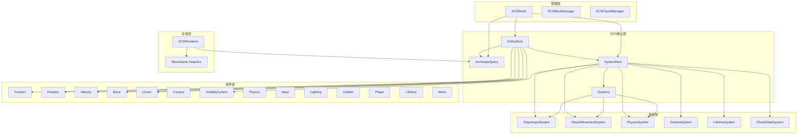
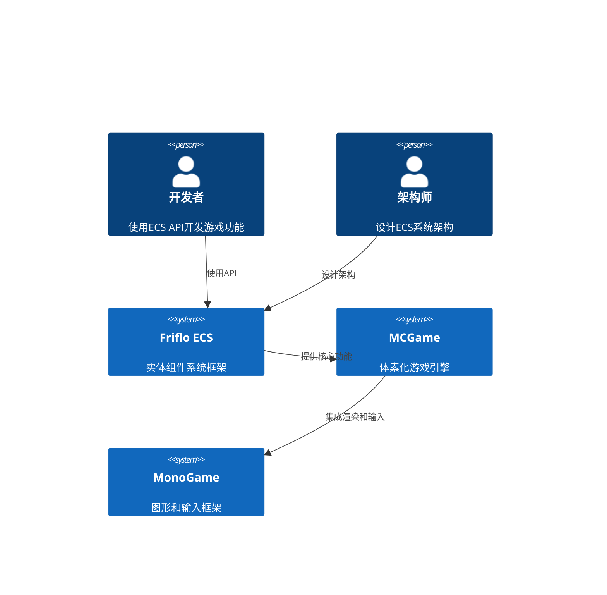

# Friflo ECS API 文档架构

## 概述

本文档描述了基于Friflo.Engine.ECS 3.4.2框架的ECS API文档架构，专为MCGame体素化游戏项目设计。该架构提供了完整的组件、系统、实体管理和查询系统的API文档。

## 架构概览

### 核心架构图



### 系统上下文



## 文档结构

### 1. 核心概念
- **实体(Entity)**: 游戏世界中的对象标识符
- **组件(Component)**: 实体的数据容器
- **系统(System)**: 处理特定组件组合的逻辑
- **查询(Query)**: 高效查找实体组合
- **存储(Store)**: 实体和组件的容器

### 2. API组织方式

#### 按功能分类
- **核心API**: EntityStore, ArchetypeQuery, SystemRoot
- **组件API**: 所有组件的详细说明
- **系统API**: 所有系统的功能和使用方法
- **管理API**: ECSWorld, ECSBlockManager, ECSChunkManager
- **渲染API**: ECSRenderer和MonoGame集成

#### 按用户角色分类
- **初级开发者**: 基础概念和简单示例
- **中级开发者**: 组件组合和系统设计
- **高级开发者**: 性能优化和高级特性
- **架构师**: 系统设计和最佳实践

### 3. 文档格式标准

#### API文档模板
```markdown
## [API名称]

### 概述
[简短描述API的用途和功能]

### 命名空间
`MCGame.ECS.[子命名空间]`

### 类定义
```csharp
public class [类名] : [基类]
{
    // 类定义
}
```

### 构造函数
```csharp
public [类名]([参数列表])
{
    // 构造函数实现
}
```

### 属性
| 属性名 | 类型 | 描述 |
|--------|------|------|
| [属性名] | [类型] | [描述] |

### 方法
#### [方法名]
```csharp
public [返回类型] [方法名]([参数列表])
{
    // 方法实现
}
```

**参数:**
- `[参数名]` ([类型]): [描述]

**返回值:**
- [类型]: [描述]

**异常:**
- [异常类型]: [描述]

**示例:**
```csharp
// 示例代码
```

### 性能特点
- **时间复杂度**: [复杂度]
- **内存使用**: [描述]
- **线程安全**: [是/否]
- **适用场景**: [描述]

### 注意事项
[重要的使用注意事项]
```

### 4. 代码示例标准

#### 基础示例
```csharp
// 创建实体
var entity = store.CreateEntity(
    new Position(0, 64, 0),
    new Rotation(0, 0, 0),
    new Player()
);

// 查询实体
var query = store.Query<Position, Player>();
foreach (var entity in query.Entities)
{
    var position = entity.GetComponent<Position>();
    var player = entity.GetComponent<Player>();
    // 处理实体
}
```

#### 系统开发示例
```csharp
public class CustomSystem : QuerySystem<Position, Velocity>
{
    protected override void OnUpdate()
    {
        Query.ForEachEntity((
            ref Position position, 
            ref Velocity velocity, 
            Entity entity) =>
        {
            // 处理逻辑
            position.Value += velocity.Value * (float)Tick.DeltaTime;
        });
    }
}
```

### 5. 性能监控和调试

#### 系统性能监控
```csharp
// 启用性能监控
systemRoot.SetMonitorPerf(true);

// 获取性能日志
var perfLog = systemRoot.GetPerfLog();

// 获取实体统计
var stats = new EntityStats
{
    TotalEntities = store.Count,
    ChunkEntities = chunkQuery.EntityCount,
    BlockEntities = blockQuery.EntityCount
};
```

### 6. 最佳实践指南

#### 组件设计原则
1. **单一职责**: 每个组件只负责一个方面的数据
2. **数据导向**: 组件应该包含数据而非逻辑
3. **轻量级**: 组件应该尽量小且简单
4. **组合性**: 组件应该可以自由组合

#### 系统设计原则
1. **高内聚**: 系统应该专注于一个功能
2. **低耦合**: 系统之间应该尽量独立
3. **性能优化**: 使用批量处理和缓存
4. **可测试性**: 系统应该易于测试

### 7. 错误处理和调试

#### 常见错误
- **组件缺失**: 实体缺少必要的组件
- **系统依赖**: 系统执行顺序问题
- **内存泄漏**: 实体未正确销毁
- **性能问题**: 查询或系统效率低下

#### 调试工具
- **实体浏览器**: 查看所有实体和组件
- **性能分析器**: 监控系统性能
- **内存分析器**: 检查内存使用情况

### 8. 扩展性设计

#### 自定义组件
```csharp
public struct CustomComponent : IComponent
{
    public float CustomValue;
    public Vector3 CustomVector;
}
```

#### 自定义系统
```csharp
public class CustomSystem : QuerySystem<CustomComponent>
{
    protected override void OnUpdate()
    {
        // 自定义处理逻辑
    }
}
```

### 9. 版本兼容性

#### Friflo ECS 3.4.2特性
- **高性能查询**: ArchetypeQuery支持
- **多线程安全**: 线程安全的实体操作
- **内存优化**: 高效的内存管理
- **类型安全**: 强类型组件系统

#### 向后兼容性
- 保持API稳定性
- 渐进式升级
- 迁移指南

### 10. 文档维护

#### 更新策略
- 每次API变更更新文档
- 定期审查和改进
- 用户反馈驱动

#### 质量保证
- 代码示例可执行
- API描述准确
- 性能数据真实

## 总结

这个架构设计提供了完整的Friflo ECS API文档结构，涵盖了从基础概念到高级特性的所有方面。文档结构清晰，易于导航，适合不同水平的开发者使用。通过标准化的文档格式和丰富的示例代码，开发者可以快速掌握ECS系统的使用方法。

### 关键特性
- **完整性**: 涵盖所有API和概念
- **易用性**: 清晰的示例和说明
- **可扩展性**: 支持自定义组件和系统
- **性能导向**: 包含性能优化指南
- **实践性**: 基于真实项目经验

这个文档架构将为MCGame项目的ECS开发提供强有力的支持。