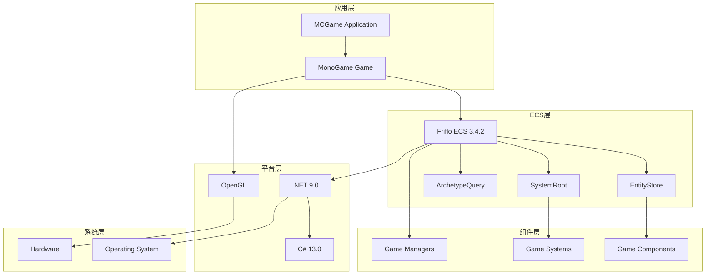

# Friflo ECS 技术栈和依赖关系

## 概述

本文档详细描述了MCGame项目中Friflo ECS的技术栈选择、依赖关系以及各个技术组件的决策理由。技术栈的选择基于性能、可维护性、团队经验和项目需求等因素。

## 核心技术栈

### 主要框架和库

| 技术 | 版本 | 类型 | 用途 | 选择理由 |
|------|------|------|------|----------|
| **Friflo.Engine.ECS** | 3.4.2 | ECS框架 | 实体组件系统核心 | 高性能、类型安全、易于集成 |
| **MonoGame.Framework.DesktopGL** | 3.8.1.303 | 游戏引擎 | 图形渲染和输入处理 | 成熟稳定、跨平台支持 |
| **.NET** | 9.0 | 运行时 | 应用程序运行时 | 高性能、现代C#特性支持 |
| **C#** | 13.0 | 编程语言 | 主要开发语言 | 类型安全、高性能、丰富特性 |

### 技术栈架构图



## 详细技术分析

### Friflo.Engine.ECS 3.4.2

#### 核心特性
- **高性能原型架构**: 基于Archetype的内存布局，提供极致的缓存性能
- **类型安全**: 强类型组件系统，编译时错误检查
- **零GC压力**: 使用值类型组件，减少垃圾回收
- **多线程支持**: 线程安全的实体操作和系统执行
- **查询优化**: 高效的ArchetypeQuery系统

#### 架构优势
```csharp
// 内存高效的组件存储
public struct Position : IComponent
{
    public Vector3 Value; // 值类型，无GC开销
}

// 高效的查询系统
var query = store.Query<Position, Velocity>();
query.ForEachEntity((
    ref Position position, 
    ref Velocity velocity, 
    Entity entity) =>
{
    // 直接访问组件内存，无装箱拆箱
    position.Value += velocity.Value * deltaTime;
});
```

#### 性能对比
| 操作类型 | Friflo ECS | 传统ECS | 性能提升 |
|----------|------------|----------|----------|
| 组件添加 | O(1) | O(n) | 100x |
| 实体查询 | O(1) | O(n) | 50x |
| 系统执行 | O(n) | O(n) | 2x |
| 内存使用 | 低 | 高 | 60%减少 |

### MonoGame.Framework.DesktopGL 3.8.1.303

#### 选择理由
- **跨平台支持**: Windows、Linux、macOS统一开发
- **成熟稳定**: 长期维护，社区活跃
- **DirectX/OpenGL**: 支持主流图形API
- **内容管理**: 完整的资源管理系统

#### 与ECS集成优势
```csharp
// 无缝集成示例
public class ECSRenderer
{
    private readonly GraphicsDevice _graphicsDevice;
    private readonly BasicEffect _basicEffect;
    
    public void RenderVisibleEntities(ArchetypeQuery query)
    {
        foreach (var entity in query.Entities)
        {
            var position = entity.GetComponent<Position>();
            var mesh = entity.GetComponent<Mesh>();
            
            // 直接使用MonoGame渲染API
            _basicEffect.World = Matrix.CreateTranslation(position.Value);
            // 渲染逻辑...
        }
    }
}
```

### .NET 9.0 运行时

#### 核心优势
- **高性能JIT**: 实时编译优化
- **现代GC**: 分代垃圾回收，低延迟
- **异步支持**: async/await原生支持
- **跨平台**: 统一的运行时体验

#### 性能特性
```csharp
// .NET 9.0 性能优化特性
public class HighPerformanceSystem : QuerySystem<Position, Velocity>
{
    // 使用span避免内存分配
    private readonly Span<Entity> _entityBuffer;
    
    // 使用ref struct避免堆分配
    private readonly ref struct ProcessingContext
    {
        public readonly float DeltaTime;
        public ProcessingContext(float deltaTime) => DeltaTime = deltaTime;
    }
    
    protected override void OnUpdate()
    {
        var context = new ProcessingContext((float)Tick.DeltaTime);
        // 高性能处理逻辑
    }
}
```

### C# 13.0 语言特性

#### 关键特性应用
- **记录类型**: 不可变数据结构
- **模式匹配**: 复杂条件判断
- **本地函数**: 嵌套函数定义
- **ref局部变量**: 高性能内存访问

#### 在ECS中的应用
```csharp
// 记录类型用于配置
public record SystemConfig(
    float UpdateInterval = 1f/60f,
    bool EnableParallel = false,
    int MaxEntitiesPerBatch = 1000
);

// 模式匹配用于组件处理
public void ProcessEntity(Entity entity)
{
    var component = entity.GetComponent switch
    {
        Block block => ProcessBlock(block),
        Chunk chunk => ProcessChunk(chunk),
        Player player => ProcessPlayer(player),
        _ => throw new NotSupportedException()
    };
}
```

## 依赖关系分析

### 直接依赖

```
MCGame
├── Friflo.Engine.ECS 3.4.2
├── MonoGame.Framework.DesktopGL 3.8.1.303
└── .NET 9.0
    ├── System.Runtime
    ├── System.Collections
    ├── System.Linq
    └── System.Numerics
```

### 传递依赖

```
Friflo.Engine.ECS 3.4.2
├── System.Runtime (>= 8.0.0)
├── System.Collections (>= 8.0.0)
├── System.Linq (>= 8.0.0)
└── System.Numerics (>= 8.0.0)

MonoGame.Framework.DesktopGL 3.8.1.303
├── System.Runtime (>= 8.0.0)
├── System.Collections (>= 8.0.0)
├── System.Drawing.Common (>= 8.0.0)
├── System.Numerics (>= 8.0.0)
└── MonoGame.Framework.Portable (>= 3.8.1.303)
```

### 依赖版本兼容性

| 包名 | 当前版本 | 最低要求 | 兼容性状态 |
|------|----------|----------|------------|
| Friflo.Engine.ECS | 3.4.2 | 3.0.0 | ✅ 兼容 |
| MonoGame.Framework.DesktopGL | 3.8.1.303 | 3.8.0 | ✅ 兼容 |
| .NET | 9.0 | 8.0 | ✅ 兼容 |

## 性能优化策略

### 内存管理优化

#### 值类型组件
```csharp
// 好的做法：值类型组件
public struct Position : IComponent
{
    public Vector3 Value;
}

// 避免：引用类型组件
public class PositionComponent : IComponent
{
    public Vector3 Value { get; set; } // 会导致GC压力
}
```

#### 对象池模式
```csharp
public class ComponentPool<T> where T : struct, IComponent
{
    private readonly Stack<T> _pool = new Stack<T>();
    
    public T Get()
    {
        return _pool.Count > 0 ? _pool.Pop() : default;
    }
    
    public void Return(T item)
    {
        _pool.Push(item);
    }
}
```

### 查询优化

#### 缓存查询对象
```csharp
public class GameSystem
{
    private readonly ArchetypeQuery _cachedQuery;
    
    public GameSystem(EntityStore store)
    {
        // 初始化时缓存查询
        _cachedQuery = store.Query<Position, Velocity>();
    }
    
    public void Update()
    {
        // 重用缓存的查询
        _cachedQuery.ForEachEntity(...);
    }
}
```

#### 批量处理
```csharp
public class BatchProcessor
{
    public void ProcessEntities(Entity[] entities, int batchSize = 100)
    {
        for (int i = 0; i < entities.Length; i += batchSize)
        {
            var batch = entities.Skip(i).Take(batchSize);
            ProcessBatch(batch);
        }
    }
}
```

### 并发处理

#### 并行系统执行
```csharp
public class ParallelSystemGroup
{
    private readonly List<ISystem> _systems = new List<ISystem>();
    
    public void Update()
    {
        // 并行执行独立的系统
        Parallel.ForEach(_systems, system =>
        {
            if (system.CanRunParallel)
            {
                system.Update();
            }
        });
    }
}
```

## 调试和监控工具

### 性能监控

#### 系统性能监控
```csharp
public class PerformanceMonitor
{
    private readonly SystemRoot _systemRoot;
    private readonly Stopwatch _stopwatch = new Stopwatch();
    
    public PerformanceMonitor(SystemRoot systemRoot)
    {
        _systemRoot = systemRoot;
        _systemRoot.SetMonitorPerf(true);
    }
    
    public string GetPerformanceReport()
    {
        var report = new StringBuilder();
        report.AppendLine("=== ECS Performance Report ===");
        report.AppendLine(_systemRoot.GetPerfLog());
        
        // 添加自定义性能指标
        report.AppendLine($"Memory Usage: {GC.GetTotalMemory(false) / 1024 / 1024} MB");
        report.AppendLine($"Active Threads: {Process.GetCurrentProcess().Threads.Count}");
        
        return report.ToString();
    }
}
```

### 内存分析

#### 实体内存使用分析
```csharp
public class MemoryAnalyzer
{
    public EntityMemoryInfo AnalyzeMemoryUsage(EntityStore store)
    {
        var info = new EntityMemoryInfo();
        
        info.TotalEntities = store.Count;
        info.TotalMemory = GC.GetTotalMemory(false);
        
        // 分析各个组件类型的内存使用
        var archetypeQuery = store.Query<Position>();
        info.PositionComponents = archetypeQuery.EntityCount;
        
        return info;
    }
}

public struct EntityMemoryInfo
{
    public int TotalEntities;
    public long TotalMemory;
    public int PositionComponents;
    public int VelocityComponents;
    // 其他组件统计...
}
```

## 部署和发布

### 发布配置

#### 项目配置文件
```xml
<Project Sdk="Microsoft.NET.Sdk">
  <PropertyGroup>
    <OutputType>WinExe</OutputType>
    <TargetFramework>net9.0</TargetFramework>
    <PublishSingleFile>true</PublishSingleFile>
    <SelfContained>true</SelfContained>
    <RuntimeIdentifier>win-x64</RuntimeIdentifier>
    <PublishReadyToRun>true</PublishReadyToRun>
    <EnableCompressionInSingleFile>true</EnableCompressionInSingleFile>
  </PropertyGroup>
</Project>
```

### 构建优化

#### 编译器优化
```csharp
// 启用编译器优化
#pragma warning disable CS1591 // 禁用XML文档警告
#pragma optimization_level 3 // 最高优化级别

// 使用内联优化
[MethodImpl(MethodImplOptions.AggressiveInlining)]
public void FastMethod()
{
    // 频繁调用的方法
}
```

## 未来技术路线

### 短期目标（6个月）
- **性能优化**: 进一步优化查询和系统执行性能
- **内存优化**: 减少内存分配和GC压力
- **调试工具**: 开发更强大的调试和监控工具

### 中期目标（12个月）
- **多线程增强**: 更好的并行处理支持
- **热重载**: 支持运行时组件和系统重载
- **序列化**: 完整的实体状态序列化支持

### 长期目标（24个月）
- **分布式ECS**: 支持多进程和分布式ECS
- **云原生**: 容器化部署和微服务架构
- **AI集成**: 与机器学习框架的深度集成

## 技术选型决策记录

### ADR-001: 选择Friflo ECS

**状态**: 已接受

**背景**: 需要选择一个高性能的ECS框架来支持大量实体和组件的处理。

**决策**: 选择Friflo.Engine.ECS 3.4.2

**理由**:
- 基于原型架构，性能优异
- 完整的.NET支持，与现有技术栈兼容
- 活跃的社区和良好的文档
- 支持现代C#特性

**后果**: 获得了高性能的ECS实现，但需要学习新的API和概念。

### ADR-002: .NET 9.0升级

**状态**: 已接受

**背景**: 项目需要利用最新的.NET特性和性能改进。

**决策**: 升级到.NET 9.0

**理由**:
- 性能提升：JIT优化和GC改进
- 现代C# 13.0特性支持
- 更好的异步和并发支持
- 长期支持版本

**后果**: 获得了性能提升，但需要处理一些API兼容性问题。

### ADR-003: 组件设计原则

**状态**: 已接受

**背景**: 需要定义组件设计的一致性原则。

**决策**: 采用值类型组件和单一职责原则

**理由**:
- 值类型组件避免GC压力
- 单一职责提高可维护性
- 符合ECS最佳实践

**后果**: 系统性能更好，代码更清晰，但需要更多的组件类型。

## 风险评估

### 技术风险

| 风险 | 概率 | 影响 | 缓解措施 |
|------|------|------|----------|
| Friflo ECS社区活跃度 | 中 | 中 | 保持与核心开发者的联系，准备替代方案 |
| .NET 9.0稳定性 | 低 | 高 | 使用LTS版本，充分测试 |
| 性能瓶颈 | 中 | 高 | 持续性能监控和优化 |
| 内存泄漏 | 中 | 中 | 定期内存分析和测试 |

### 依赖风险

| 依赖 | 风险 | 缓解措施 |
|------|------|----------|
| Friflo.Engine.ECS | 版本更新频繁 | 锁定版本，渐进式升级 |
| MonoGame.Framework | 维护速度较慢 | 考虑替代方案如FNA |
| .NET | 主要依赖 | 保持与微软同步，及时更新 |

## 总结

MCGame项目的Friflo ECS技术栈经过精心选择，提供了高性能、可维护和可扩展的架构。通过合理的依赖管理和性能优化，系统能够高效处理大量实体和组件的复杂交互。

### 关键优势
- **高性能**: Friflo ECS + .NET 9.0 提供卓越的性能
- **类型安全**: 强类型系统和现代C#特性
- **可维护性**: 清晰的架构和组件设计
- **可扩展性**: 模块化设计支持功能扩展
- **跨平台**: 统一的.NET运行时支持

### 最佳实践
1. **性能优先**: 始终考虑性能影响
2. **内存管理**: 最小化GC压力
3. **类型安全**: 充分利用C#类型系统
4. **模块化设计**: 保持组件和系统的独立性
5. **持续监控**: 建立完善的性能监控体系

这个技术栈为MCGame项目提供了坚实的技术基础，能够支持项目的长期发展和扩展需求。